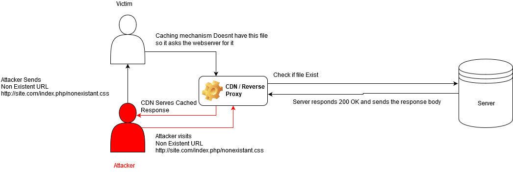

# Bugs

## Web Cache Deception

This happens when a CDN or some caching mechanism caches a static file without checking is the content of that file is static or not

**https://www.youtube.com/watch?v=mroq9eHFOIU**

## Conditions

 - The Web Application has to cache files with extensions disregarding any caching headers
 - When visiting a non existant page like localhost/home.php/notanactualfile.css the response of the request should server the content of home.php and has to be 200 OK
 - The victim has to be authenticated inorder to exfil session or csrf tokens
 - The Web Application should have a caching CDN like cloudflare,cloudfront or akami

## Web Cache Poisoning

This vulnerability can be used to serve malicious payload by poisoning the cache.Like XSS

To find a Web Cache Posioning Vulnerability these headers can be used

    X-Host:Vulnerable Payload
    X-Forwarded-Host: Payload
If the following payload gets reflected in the Response we can use the cache to store it and serve it to the victims. 

**Tip**

*Try Match and Replace to add a X-Forwarded-Host header to requests to  and set the url to collabrator client to see ping requests from vulnearble site*

    X-Forwarded-Host:evil.com
    X-Forwarded-Scheme:nohttps
Can lead to openredirect

[Reference](https://www.youtube.com/watch?v=iSDoUGjfW3Q)
